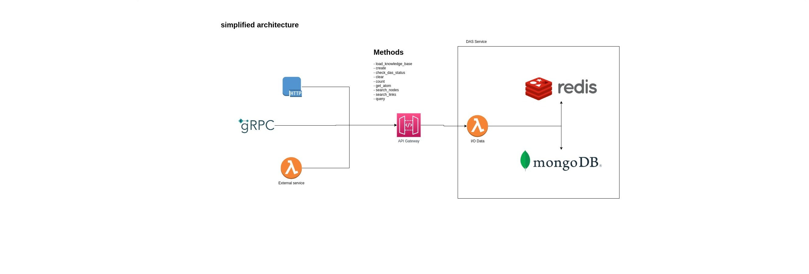

# Documentation of Project Infrastructure Repositories

This document provides information about the project's infrastructure repositories and how to configure the infrastructure on two different cloud platforms: Vultr and AWS. The infrastructure repositories contain scripts and configurations necessary to create the infrastructure and deploy functions for the DAS project.

AWS:

Vultr:

## Vultr Infrastructure

### Vultr Repositories

#### 1. `das-pre-infra-vultr`

This repository, located at [GitHub](https://github.com/singnet/das-pre-infra-vultr), contains essential scripts and configurations to create all the resources required to run DAS on the Vultr platform using Terraform.

#### 2. `das-infra-stack-vultr`

This repository, available on [GitHub](https://github.com/singnet/das-infra-stack-vultr), includes all the scripts and files needed to deploy DAS on the infrastructure created by the `das-pre-infra-vultr` repository using Terraform.

### Details of the `das-infra-stack-vultr` Repository

The `das-infra-stack-vultr` repository contains the following components:

#### OpenFaaS Functions

This repository is responsible for configuring and managing OpenFaaS functions that are part of the DAS. These functions are deployed in an OpenFaaS environment based on the settings defined in the `functions.yaml` file.

##### Repository Structure

- `functions-up.sh`: This script is used to deploy OpenFaaS functions based on the configurations defined in the `functions.yaml` file. It utilizes the `faas-cli` tool for this task.

- `functions.yaml`: This file contains the configurations for OpenFaaS functions, including details such as name, programming language, Docker image, environment variables, and other related parameters.

- `pull-handlers.sh`: This script is used to update the handlers of the functions from the Git repository. It pulls the latest changes from relevant branches (e.g., "main" and "meetup") to keep the functions up-to-date.

- `push.sh`: This script makes it easy to send the configurations and scripts needed to the OpenFaaS server. It copies the `functions.yaml` and `pull-handlers.sh` files to the server and runs `pull-handlers.sh` remotely to update the handlers.

- `ssh.sh`: This script allows you to access the OpenFaaS server via SSH using the specified authentication key.

##### Function Configuration

The configurations for OpenFaaS functions are defined in the `functions.yaml` file. Each function is configured with the following details:

- Function name.
- Programming language.
- Handler (path to the function's code).
- Docker image.
- Environment variables related to the function.

##### Using the Scripts

To use the provided scripts in this repository, follow these steps:

1. **Function Deployment**:

   - Use the `functions-up.sh` script to deploy functions in the OpenFaaS environment. You can specify an optional filter to deploy only specific functions if needed.

2. **Handler Updates**:

   - Use the `pull-handlers.sh` script to keep the handlers of the functions updated. It will pull the latest changes from relevant branches in the Git repositories of the functions.

3. **Sending Configurations and Scripts**:

   - The `push.sh` script makes it easy to send the configurations and scripts to the OpenFaaS server. It will copy the `functions.yaml` and `pull-handlers.sh` files to the server and run `pull-handlers.sh` remotely to update the handlers.

4. **Accessing the OpenFaaS Server**:
   - Use the `ssh.sh` script to access the OpenFaaS server via SSH using the specified authentication key.

Make sure to properly configure the environment variables and other necessary parameters in the function configurations in `functions.yaml` before deploying the functions.

Note: Ensure that you have the appropriate permissions and correctly configure SSH keys and other authentication details for the OpenFaaS server before using these scripts.

## AWS Infrastructure

### AWS Repositories

#### 1. `das-pre-infra-aws`

The `das-pre-infra-aws` repository, located at [GitHub](https://github.com/singnet/das-pre-infra-aws), contains essential scripts and configurations to create all the resources required to run DAS on the AWS platform using Terraform.

#### 2. `das-infra-stack-aws`

The `das-infra-stack-aws` repository, available on [GitHub](https://github.com/singnet/das-infra-stack-aws), creates the resources for DAS in the infrastructure set up previously by the `das-pre-infra-aws` repository. This allows you to create DAS functions, for example.

## Versioning Workflow

In the context of the presented repositories, the versioning process follows a workflow based on a GitHub Actions Reusable Workflow. This workflow is configured through a file called `version-tagging.yml`, located in the `.github/workflows` directory of each repository. Additionally, the versioning process leverages a Docker image to carry out version tagging. The details of the Docker image are specified in the `job-image-namespace` and `job-image-version-semver` variables, provided as part of the project's pipeline, for example.

To initiate the versioning process, you can manually trigger the workflow using the `workflow_dispatch` event, allowing you to activate the workflow directly from the GitHub Actions interface. When triggering the workflow, you will be prompted to provide a value for the `version` variable.

Once the versioning workflow is manually triggered, it will follow the configured steps to determine the next version for your project. Based on the variables and versioning strategy specified, the workflow will automatically create a new version tag in the repository. This ensures that your project's versions are systematically and automatically tracked, making it easier to monitor project progress and manage versions.

The GitHub repository for this workflow can be found at [GitHub](https://github.com/singnet/das-scripts-pipeline).

## Benchmarking

We use `wrk` to simulate various client loads and measure the performance of our services. With `wrk`, we can customize the number of connections, threads, and the duration of the test to mimic real-world scenarios.

|           | AWS | Vultr |
| --------- | --- | ----- |
| query     |     |       |
| get_nodes |     |       |
| get_node  |     |       |
